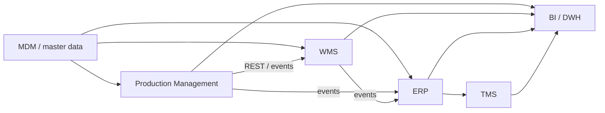

# sa-portfolio / spicerrr

**system analysis · product / enterprise · integrations · data**

Здесь собрана подробная часть профиля: системно-аналитические кейсы, коммерческий контекст и технические артефакты.

---

## 01 · SA-кейсы

| Кейс | Домен | Фокус | Статус |
|:---|:---|:---|:---|
| **Смена** | FitnessTech / mobile | session lifecycle, REST API, State Machine, ERD, продуктовые события, ошибки и повторные запросы | в работе |
| [**🌱 Агроконтур**](agritech/README.md) | AgriTech / enterprise | master data, Production → WMS / ERP, интеграционные контракты, событийный обмен, модели данных | пакет артефактов v1.0; реконструкция |

**Смена** — продуктовый кейс под mobile / B2C.  
**Агроконтур** — enterprise-кейс на базе коммерческого опыта: цифровизация производственных процессов, подготовка требований к автоматизации отдельных участков и интеграция внутренних систем.

---

## 02 · коммерческий опыт

**«Агроном-Сад» / цифровая трансформация производственного предприятия**

Рабочий контекст — не «автоматизация завода под ключ», а цифровизация отдельных процессов и связка нескольких контуров: производство, склад, логистика, master data и BI.

| Зона | Что делала |
|:---|:---|
| **Процессы** | Разбирала ручные и Excel-процессы, собирала AS-IS / TO-BE, фиксировала роли, точки ввода данных, проверки и требования к автоматизации отдельных шагов |
| **ERP / WMS / TMS** | Описывала стыки между производством, складом и логистикой: где появляются данные, кто ими владеет, куда они передаются и когда должны синхронизироваться |
| **Master Data** | Приводила к общей модели справочники сортов, участков, партий и операций: атрибуты, идентификаторы, дубли, mappings между источниками |
| **Интеграции** | Фиксировала состав обмена, источник / получателя, JSON / XML, контрольные точки, ошибочные сценарии и повторную обработку |
| **Модели** | ERD для предметной области, UML для состояний и взаимодействий, BPMN для процессов и ручных разрывов |
| **BI / отчётность** | Формализовала требования к данным и витринам; отдельный кусок — ТЗ на дашборд «Паспорт сорта» |
| **Версионирование** | Git / GitLab для OpenAPI, PlantUML, SQL, mappings и служебных скриптов; feature-ветки, Merge Requests, review, tags |

> Предметный контекст основан на рабочем опыте. Публичная архитектура и часть технического стека реконструированы и обезличены — без внутренней документации компании.

### как выглядит контур

Типовой объект — партия урожая: создаётся в производственном контуре, принимается в WMS, становится объектом учёта в ERP и дальше используется в аналитике. На стыках важны ownership данных, единые ID, mappings и обработка рассинхронизации.

---

## 03 · стек

| Область | Что использую | Для чего |
|:---|:---|:---|
| **API-контракты** | OpenAPI 3 · Swagger UI / Editor | методы, схемы, статусы, ошибки; контракт можно ревьюить и версионировать |
| **Проверка API** | Postman | happy / negative path, параметры, токены, окружения, ручная проверка endpoint'ов |
| **Синхронные интеграции** | REST / HTTP · JSON / XML | request / response-сценарии между внутренними системами |
| **Событийные интеграции** | RabbitMQ · event contracts · routing · retry / DLQ · idempotency · correlation ID | асинхронный обмен между производственным, складским и логистическим контурами |
| **Kafka** | producer / consumer model · topics · event schema | прорабатываю в FitnessTech-кейсе под event-driven сценарии |
| **Данные** | PostgreSQL · SQL | операционные модели, выборки, joins, проверки связности данных |
| **Моделирование** | UML / PlantUML · BPMN · ERD / IDEF1X | состояния, последовательности, процессы, модели предметной области |
| **Версионирование** | Git · GitLab | branches, commits, Merge Requests, review, tags; версионирование OpenAPI / UML / SQL |
| **Автоматизация / анализ** | Python · pandas · Jupyter | подготовка, сверка и исследовательский анализ данных |

---

## 04 · учебные проекты ВШЭ

| Домен | Проект | Что внутри |
|:---|:---|:---|
| **Data Engineering / Analytics** | [**Sci-Fi Movies**](https://github.com/spicerrr/sci-fi-movies) | TMDb + OMDb, сбор и объединение данных, нормализация, EDA, проверка гипотез |
| **NLP / Content Analysis** | [**Oscar × HdRezka**](https://github.com/spicerrr/oscar-rezka-comments) | 20k+ комментариев, стратифицированная выборка, локальная LLM-разметка, проверка и анализ |
| **Digital Media / Data Storytelling** | [**Reddit: восемь версий одного года**](https://github.com/spicerrr/reddit-2025-longread) | интерактивный дата-лонгрид, агрегирование данных, визуальная структура и веб-интерфейс |
| **Data Visualization / Fitness** | [**52 Days of GYM**](https://github.com/spicerrr/52-days-of-GYM) | интерактивная визуализация тренировочного цикла из логов Strong |

---

