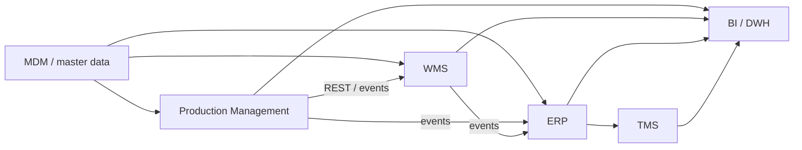

# sa-portfolio / spicerrr

**system analysis · product / enterprise · integrations · data**

Здесь собрана подробная часть профиля: системно-аналитические кейсы, коммерческий контекст и технические артефакты.

---

## 01 · SA-кейсы

| Кейс | Домен | Фокус |
|:---|:---|:---|:---|
| **Смена** | продуктовый кейс под mobile / B2C | session lifecycle, REST API, State Machine, ERD, продуктовые события, ошибки и повторные запросы |
| [**🌱 Агроконтур**](agritech/README.md) | enterprise / Агротех| master data, Production → WMS / ERP, интеграционные контракты, событийный обмен, модели данных | пакет артефактов v1.0; реконструкция |

---

## 02 · коммерческий опыт

**«Агроном-Сад» / цифровизация производственных процессов**

Работаю с внутренними системами и данными на стыке производства, склада и логистики. Основной кусок — формализация процессов, master data и требований к цифровым инструментам.

| Зона | Что делала |
|:---|:---|
| **Процессы** | Разбирала текущие ручные / Excel-сценарии, фиксировала AS-IS и изменения для TO-BE |
| **Master Data** | Сводила справочники сортов, участков, партий и операций к общей модели; разбирала атрибуты, ID, дубли и соответствия между источниками |
| **Системные контуры** | Работала со стыками производственного учёта, ERP / WMS / TMS и BI — кто создаёт данные, кто их потребляет и где возникают расхождения |
| **Требования** | Описывала бизнес-правила, состав данных, проверки и сценарии для внутренних инструментов |
| **Моделирование** | Использовала BPMN, ERD и UML, когда текстом уже становилось неудобно |
| **BI** | Формализовала требования к данным и отчётности; отдельный кейс — «Паспорт сорта» |

### как выглядит контур

Типовой объект — партия урожая: создаётся в производственном контуре, принимается в WMS, становится объектом учёта в ERP и дальше используется в аналитике. На стыках важны ownership данных, единые ID, mappings и обработка рассинхронизации.

---

## 03 · стек

| Область | Что использую | Для чего |
|:---|:---|:---|
| **API-контракты** | OpenAPI 3 · Swagger UI / Editor | методы, схемы, статусы, ошибки; контракт можно ревьюить и версионировать |
| **Проверка API** | Postman | happy / negative path, параметры, токены, окружения, ручная проверка эндпоинтов |
| **Синхронные интеграции** | REST / HTTP · JSON / XML | request / response-сценарии между внутренними системами |
| **Событийные интеграции** | RabbitMQ, Kafka | RabbitMQ — асинхронный обмен между производственным, складским и логистическим контурами в работе, Kafka — в кейсе DDX под event-driven сценарии |
| **Данные** | PostgreSQL · SQL | операционные модели, выборки, проверки связности данных |
| **Моделирование** | UML / PlantUML · BPMN · ERD / IDEF1X | состояния, последовательности, процессы, модели предметной области |
| **Версионирование** | Git · GitLab | версионирование OpenAPI / UML / SQL |
| **Автоматизация / анализ** | Python · pandas · Jupyter | подготовка, сверка и исследовательский анализ данных |

---

## 04 · учебные проекты ВШЭ

| Домен | Проект | Что внутри |
|:---|:---|:---|
| **Data Engineering / Analytics** | [**Sci-Fi Movies**](https://github.com/spicerrr/sci-fi-movies) | TMDb + OMDb, сбор и объединение данных, нормализация, EDA, проверка гипотез |
| **NLP / Content Analysis** | [**Oscar × HdRezka**](https://github.com/spicerrr/oscar-rezka-comments) | 20k+ комментариев, стратифицированная выборка, локальная LLM-разметка, проверка и анализ |
| **Digital Media / Data Storytelling** | [**Reddit: восемь версий одного года**](https://github.com/spicerrr/reddit-2025-longread) | интерактивный дата-лонгрид, агрегирование данных, визуальная структура и веб-интерфейс |
| **Data Visualization / Fitness** | [**52 Days of GYM**](https://github.com/spicerrr/52-days-of-GYM) | интерактивная визуализация тренировочного цикла из логов Strong |

---

