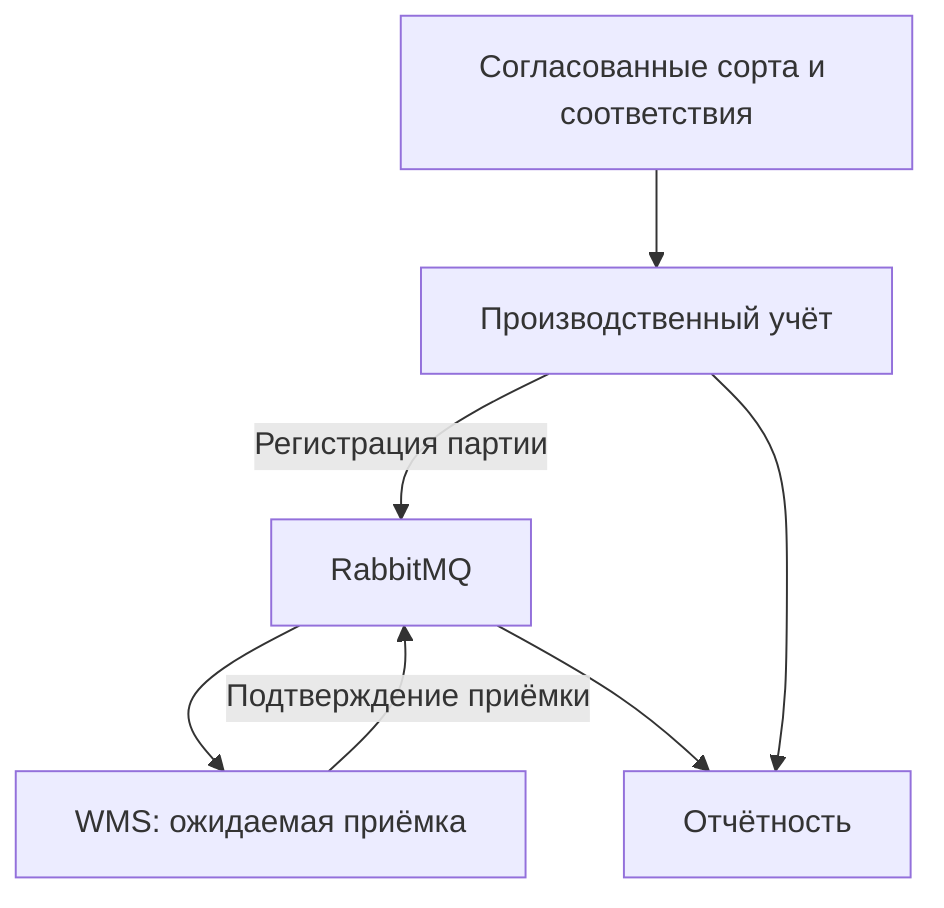

<div align="center">

# 📦 движение партии

**пользовательские сценарии · производственный учёт · процессы · данные и интеграции**


[← портфолио](../README.md) · [исходные данные](docs/data-model.md#source-data) · [сценарии использования](docs/use-cases.md) · [OpenAPI](contracts/openapi.yaml)

</div>

## 🧭 задача

Оператор регистрирует сбор, кладовщик подтверждает приёмку, руководитель получает отчёт. Проект связывает их действия с правилами учёта и передачей данных между системами.

Производство регистрирует сбор по участкам, склад — приёмку, учётный контур — номенклатуру и документы. Одни и те же сущности в источниках называются и кодируются по-разному.

Например, производство фиксирует 8420 кг сорта «ГОЛДЕН ДЕЛИШЕС», а склад — 8370 кг «Голден». Совпадения названия и даты недостаточно, чтобы признать записи одной партией: нужно сохранить оба измерения, связать документы и отдельно разобрать расхождение 50 кг.

Обезличенная проектная реконструкция задач производственного учёта. Примеры данных условные.

## 📂 документация

| Раздел | Содержание |
|:---|:---|
| [Контекст](docs/context.md) | задача, границы решения и ответственность за данные |
| [Заинтересованные стороны](docs/stakeholders.md) | цели подразделений, конфликты и согласование решений |
| [Процесс AS-IS / TO-BE](docs/processes.md) | регистрация, передача и приёмка; точки ручного контроля |
| [Сценарии использования](docs/use-cases.md) | цели пользователей, основные потоки, альтернативы и исключения |
| [Требования](docs/requirements.md) | бизнес-правила, функции, ограничения и требования к качеству |
| [Справочные данные](docs/master-data.md) | локальные коды, единый сорт и правила соответствия |
| [Модель данных](docs/data-model.md) | исходные источники, целевая модель, состояния и расчёт показателей |
| [Переход данных](docs/migration.md) | промежуточный слой, разрешение конфликтов и сверка |
| [Интеграции](docs/integration.md) | OpenAPI, RabbitMQ, повторная доставка и очередь недоставленных сообщений |
| [Проверка требований](docs/acceptance.md) | сценарии проверки и трассировка |
| [Версионирование](docs/versioning.md) | согласование изменений требований, контрактов и данных |

## 🏗 взаимодействие систем



Справочные данные обеспечивают единые идентификаторы и соответствия локальных кодов. Производственный и складской контуры остаются владельцами собственных фактов; обмен связывает их общим идентификатором партии.

## 🧪 проверка

```bash
python -m pip install -r agritech/requirements-check.txt
python agritech/scripts/validate.py
python agritech/scripts/normalize.py
python agritech/scripts/check_legacy.py
```

Проверяются OpenAPI, схема событий, примеры данных, ссылки между документами, SQL, диаграммы и трассировка требований. [Коллекция Postman](contracts/postman.collection.json) содержит запросы для стенда. Результаты испытаний работающей системы в этом репозитории не заявляются.
