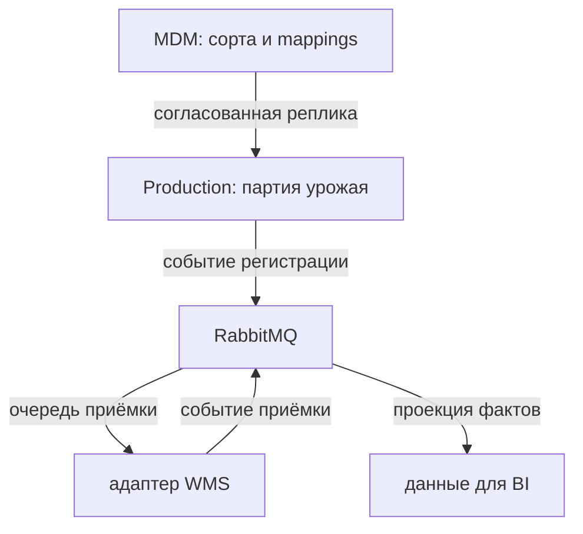

<div align="center">

# 🌱 агроконтур

**единые справочники · прослеживаемость партий · ERP / WMS · аналитика**


[← портфолио](../README.md) · [требования](docs/requirements.md) · [API](contracts/openapi.yaml) · [приёмка](docs/acceptance.md)

</div>

## 🧭 задача

Партия урожая проходит через производство, склад и учёт. Если каждый контур по-своему обозначает сорт, участок и партию, связать производственный факт со складской приёмкой и показателями сорта приходится вручную.

Кейс показывает системный анализ этой задачи: согласование справочников, определение владельцев данных, требования к обмену Production → WMS и правила расчёта данных для «Паспорта сорта».

> Основа — мой опыт цифровой трансформации в «Агроном-Саде»: требования к внутренним системам и ERP / WMS / TMS, master data, модели процессов и данных, ТЗ на «Паспорт сорта», оценка цифровой зрелости. Публичные артефакты созданы заново; архитектура, контракты, GitLab-процесс и технические детали — спроектированная реконструкция. Все записи и числовые примеры синтетические. [Границы и происхождение](docs/context.md).

## 👩🏻‍💻 работа аналитика

| Направление | Что разобрано | Где посмотреть |
|:---|:---|:---|
| Процессы | Ручное сопоставление справочников, повторный ввод партии, целевой обмен | [AS-IS / TO-BE](docs/processes.md), [BPMN](diagrams/batch-process.bpmn) |
| Master data | Канонические ID, ключи источников, неоднозначные соответствия, владелец изменений | [MDM](docs/master-data.md), [пример mappings](examples/source-mappings.csv) |
| Требования | Бизнес-цель, правила, системное поведение, ограничения качества | [Каталог](docs/requirements.md) |
| Интеграции | Синхронная регистрация, асинхронная передача, подтверждение приёмки, ошибки | [Контракты и доставка](docs/integration.md), [OpenAPI](contracts/openapi.yaml) |
| Модели | Сущности, ограничения, два независимых жизненных цикла | [ERD и словарь](docs/data-model.md), [UML](diagrams/sequence.puml) |
| BI | Гранулярность, знаменатель урожайности, сверка масс, свежесть источников | [«Паспорт сорта»](docs/variety-passport.md), [SQL](sql/02_passport.sql) |
| Цифровая зрелость | Домены оценки, признаки проблемы, требования к доказательствам | [Диагностика](docs/maturity.md) |
| Изменения и проверка | Версии требований и контрактов, MR, проверяемые критерии | [Версионирование](docs/versioning.md), [сценарии приёмки](docs/acceptance.md) |

## 🏗 границы решения

Подробно проработаны **MDM → Production → WMS → витрина сорта**. ERP владеет экономическим учётом, TMS — рейсами, Quality — результатами контроля; их полные контракты вынесены за границы версии 1.0.



## 📂 маршрут просмотра

1. [Контекст и владельцы данных](docs/context.md) — какую часть бизнеса моделируем.
2. [Процесс](docs/processes.md) и [требования](docs/requirements.md) — какое поведение нужно получить.
3. [MDM](docs/master-data.md) и [модель данных](docs/data-model.md) — как сопоставляются записи.
4. [OpenAPI](contracts/openapi.yaml), [события](contracts/events.schema.json) и [правила доставки](docs/integration.md) — как договорились системы.
5. [Метрики](docs/variety-passport.md) и [приёмка](docs/acceptance.md) — как проверить результат.

## 🧪 проверка артефактов

Из корня `sa-portfolio`:

```bash
python -m pip install -r agritech/requirements-check.txt
python agritech/scripts/validate.py
python agritech/scripts/normalize.py
```

Валидатор проверяет структуру OpenAPI, JSON Schema и примеры событий, ссылки документов, BPMN, сопоставления справочников и связи требований со сценариями. Скрипт нормализации выводит решения для трёх синтетических исходных записей. SQL предназначен для PostgreSQL; это проект схемы и витрины, не работающая корпоративная система. Postman-коллекция предназначена для будущего стенда: API-сервер и RabbitMQ в репозитории не развёрнуты.

## 🎯 место в портфолио

«Смена» — основной продуктовый кейс для FitnessTech: приложение, пользовательское поведение и жизненный цикл сессии. «Агроконтур» дополняет его корпоративной стороной: владельцы данных, разрозненные источники, интеграционные разрывы и воспроизводимые метрики. У этого кейса нет отдельного приложения и продуктовой игровой механики.
