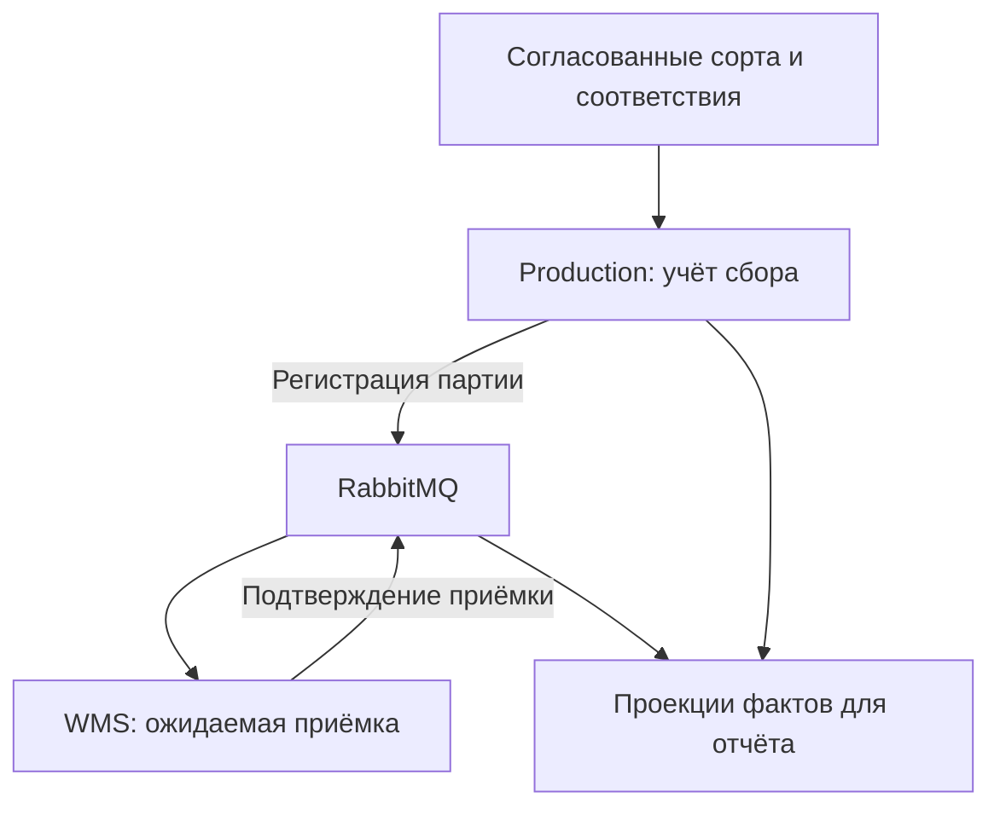

<div align="center">

# 🌱 агроконтур

**справочники сортов · учёт урожая · складская приёмка · паспорт сорта**


[← портфолио](../README.md) · [исходные данные](docs/as-is-data.md) · [Use Case](docs/use-cases.md) · [контракты](contracts/openapi.yaml)

</div>

## 🧭 задача

«Агроном-Сад» выращивает яблоки. Данные о посадках, сборе, складской приёмке и учёте используются для контроля движения урожая и подготовки отчётов по сортам.

Производство регистрирует сбор по участкам, склад — поступления, учёт — номенклатуру и документы. Для отчёта по сорту необходимо связать эти записи. Названия сортов расходятся; строка журнала сбора и строка складской приёмки имеют разные ключи; площадь относится к участку и сезону, масса — к отдельному факту.

Например, в журнале записано 8420 кг «ГОЛДЕН ДЕЛИШЕС» с участка 44, на складе — 8370 кг «Голден». Разница 50 кг подлежит сверке. Совпадения названия и даты недостаточно, чтобы признать записи одной партией.

Обезличенная проектная реконструкция задач цифровизации «Агроном-Сада»; примеры данных условные.

## 📂 документация

| Раздел | Содержание |
|:---|:---|
| [Контекст](docs/context.md) | Предприятие, задача, назначение систем и правила первой версии |
| [Заинтересованные стороны](docs/stakeholders.md) | Цели подразделений, конфликты, права на решения, согласование |
| [Данные до изменений](docs/as-is-data.md) | Источники, локальные ключи, единица записи, разрывы связности |
| [Процесс AS-IS / TO-BE](docs/processes.md) | Регистрация, передача и приёмка; точки ручного контроля |
| [Use Case](docs/use-cases.md) | Пять целей пользователей, основные потоки, альтернативы и исключения |
| [Требования](docs/requirements.md) | Правила, функции, качество и связь с источниками проблемы |
| [Справочники](docs/master-data.md) | Ключи источников, единый сорт, согласование соответствий |
| [Целевая модель данных](docs/data-model.md) | UML классов, ERD, ограничения и независимые состояния |
| [Переход данных](docs/migration.md) | Архив источников, промежуточный слой, разрешение конфликтов, сверка |
| [Интеграции](docs/integration.md) | OpenAPI, RabbitMQ, повторы, подтверждения и DLQ |
| [Паспорт сорта](docs/variety-passport.md) | Источники показателей, формулы, полнота и актуальность |
| [Проверка требований](docs/acceptance.md) | Сценарии проверки и трассировка |
| [Версионирование](docs/versioning.md) | Согласование изменений требований, контрактов и данных |
| [Цифровая зрелость](docs/maturity.md) | Вопросы обследования и необходимые свидетельства |

## 🏗 взаимодействие систем



Production — производственный учёт, WMS — складская система, BI — отчётность. Управление справочниками (MDM) обеспечивает единые сорта и соответствия локальных кодов. Складской и учётный контуры далее используют данные для хранения, сортировки, перевозок и расчёта затрат.

## 🧪 проверка спецификаций и примеров

```bash
python -m pip install -r agritech/requirements-check.txt
python agritech/scripts/validate.py
python agritech/scripts/normalize.py
python agritech/scripts/check_legacy.py
```

Проверяются спецификации, примеры данных, ссылки, исходники и изображения UML, трассировка и правила сверки исходных записей. [Postman](contracts/postman.collection.json) содержит запросы для стенда. Репозиторий содержит проектную документацию и проверку её согласованности. Сценарии приёмки задают ожидаемое поведение системы; результаты испытаний на стенде фиксируются отдельно.
