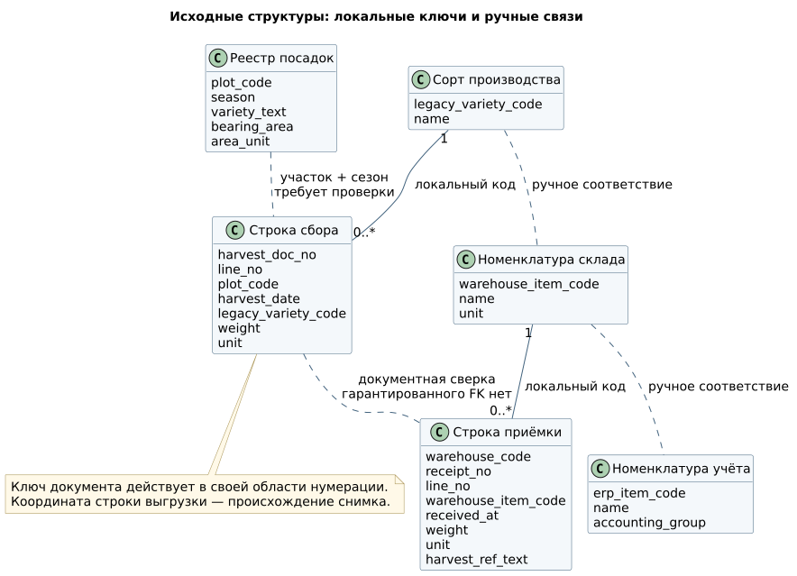

# 🗃 данные до изменений

До перехода к согласованному учёту производство ведёт журнал сбора и реестр посадок, а склад и учёт используют собственные документы и справочники. Ниже показано, что означает одна строка каждого источника и как её можно связать с другими записями.

## Источники: что означает одна запись

| Источник | Одна запись | Локальный ключ | Поля | Ответственный |
|:---|:---|:---|:---|:---|
| Реестр посадок | Участок в сезоне | `plot_code + season` в пределах файла | Наименование участка, сорт текстом, общая / плодоносящая площадь, единица | Главный агроном |
| Локальный справочник сортов | Сорт в производственном реестре | `legacy_variety_code` | Название, состояние, примечание | Ответственный за справочники |
| Журнал сбора | Документ и его строка | `harvest_doc_no + line_no` в области производства и сезона | Дата, участок, код / имя сорта, масса, единица | Производственный учёт |
| Складской справочник | Складская номенклатура | `warehouse_item_code` | Название, локальная единица | Склад |
| Документ приёмки | Строка документа на складе | `warehouse_code + receipt_no + line_no` | Время, код номенклатуры, масса, единица, текстовая ссылка на документ сбора | Кладовщик |
| Учётный справочник | Номенклатура ERP | `erp_item_code` | Название, учётная группа, единица | Экономист |
| Таблица сверки | Ручное утверждение связи двух строк | Пара полных локальных ключей | Автор решения, дата, основание, замечание | Производство и склад |

Имя файла, лист и строка (`file / sheet / row`) определяют происхождение снимка, но меняются при сортировке. Если документа и номера строки нет, устойчивый ключ назначается при первичном приёме снимка и хранится отдельно; формировать его заново при каждой загрузке запрещено.

## UML исходных структур

[PlantUML](../diagrams/as-is-data.puml). Сплошные связи действуют внутри источника; пунктирные обозначают предполагаемое сопоставление, которое требует проверки. Между строкой сбора и приёмкой нет гарантированного внешнего ключа.

## Пример разрыва

Примеры исходных таблиц: [посадки](../examples/legacy-plantings.csv), [журнал сбора](../examples/legacy-harvest.csv), [приёмки](../examples/legacy-receipts.csv). Они сохраняют поля своих источников; готовый `batchId` в историю не добавлен.

| Источник | Локальная запись | Значение |
|:---|:---|:---|
| Посадки | `44 / 2026` | `LEG-V-7`, 2 га плодоносящей площади |
| Сбор | `СБ-1284 / 1` | `44`, «ГОЛДЕН ДЕЛИШЕС», 8.420 т |
| Приёмка | `WH-01 / ПР-911 / 1` | `WMS-V-22`, «Голден», 8370 кг, ссылка «1284» |
| Учёт | `ERP-V-104` | «Golden Delicious» |

Название «Голден» не доказывает соответствие `LEG-V-7`; ссылка «1284» не содержит область нумерации и номер строки. Даже после подтверждения сорта связь двух фактов остаётся отдельным решением. В целевом процессе её заменяет передача `batchId`; история требует реестра сверки.

## Дефекты и контроль

| ID | Дефект | Проверка | Реакция / требование |
|:---|:---|:---|:---|
| DQ-01 | Разные имена / коды одного сорта | Сравнить локальные ключи и подтверждённые атрибуты | Утвердить соответствие, BR-01, FR-01 |
| DQ-02 | Повтор документа в нескольких выгрузках | Полный ключ + хеш значимых полей | Идентичный повтор пропустить; разные значения отправить на разбор, BR-02 |
| DQ-03 | Масса без единицы | Единица обязательна, преобразование `т × 1000 = кг` | Не угадывать единицу, оставить запись неразрешённой |
| DQ-04 | Несколько сборов с одинаковой датой и сортом | Проверить точную связь исходных строк | Не соединять только по дате и имени |
| DQ-05 | Площадь размножается в соединении с журналом | Суммировать участки до соединения с партиями | BR-04 / FR-05 |
| DQ-06 | Изменённая строка старого документа | Один локальный ключ, разное содержимое снимков | Сохранить обе версии; решение владельца, FR-07 |

## Переход к целевой модели

| AS-IS | TO-BE | Что сохраняется |
|:---|:---|:---|
| Локальный код сорта | Единый `varietyId` + таблица соответствий | Исходный код и имя |
| Номер документа в локальной области | `sourceSystem + sourceRecordId`, затем `batchId` | Полный документный ключ и происхождение |
| Текстовая связь приёмки | Переданный `batchId` | Складской `lotId` и документ |
| Масса и единица в каждой форме | Масса в килограммах | Исходное значение / единица в архиве |
| Площадь повторяется в отчётных строках | Отдельный участок–сезон | Подтверждённая площадь и сезон |

[Целевая модель](data-model.md) · [Переход и сверка](migration.md).
