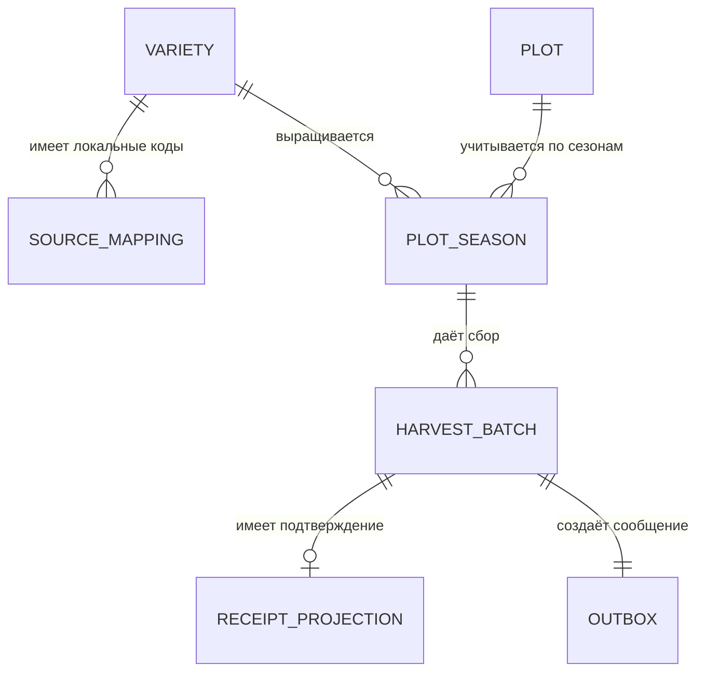

# 🧱 модель данных

Модель отделяет справочники, производственный сбор, складское измерение и служебные записи передачи сообщений. Словарь содержит назначение каждой таблицы; точные типы полей и ограничения заданы в [SQL-схеме](../sql/01_schema.sql).

## Как исходные записи связаны с новой моделью

| Исходные данные | Целевое поле | Значение |
|:---|:---|:---|
| Код сорта в локальном справочнике | `source_mapping.source_id` → `variety_id` | Согласованная связь локального и единого сортов |
| Номер документа и строки сбора | `source_system + source_record_id` | Идентификатор исходного факта в конкретной системе |
| Участок и сезон | `plot_id + season` | Посадка и её плодоносящая площадь |
| Масса и исходная единица | `weight_kg` | Масса, приведённая к килограммам; оригинал остаётся в архиве загрузки |
| Складской документ | `lot_id` | Номер складского факта |
| Связь складского документа со сбором | `receipt_projection.batch_id` | Номер производственной партии, переданный складу |

Локальный код сорта, номер производственной партии и складской номер решают разные задачи. Например, `VAR-017` обозначает сорт, `batchId` — конкретный сбор, `lotId` — складскую запись. [Исходная модель](as-is-data.md).

## UML классов

[Исходник PlantUML](../diagrams/data-model.puml). Производственная система хранит собственные факты и локальную копию подтверждения WMS. Оригинал складского документа остаётся в WMS.

## Связи таблиц

Для первой версии одна партия создаёт одно сообщение о регистрации и имеет не более одной полной приёмки. При добавлении новых видов сообщений количество исходящих записей на партию может увеличиться.

## Назначение таблиц

| Таблица | Одна запись | Основные поля | Правило |
|:---|:---|:---|:---|
| `variety` — сорта | Единый сорт | Код `variety_id`, название `canonical_name`, признак активности `active` | Переименование не меняет код; имя не используется как ключ |
| `source_mapping` — соответствия | Локальный код сорта в системе-источнике | Система, тип сущности, локальный код, единый сорт, исходное имя | Сочетание системы, типа и кода уникально; тип в первой версии — `VARIETY` |
| `plot` — участки | Учётный участок | Код `plot_id`, название `plot_name` | Код стабилен при переименовании |
| `plot_season` — посадки по сезонам | Участок в одном сезоне | Участок, сезон, сорт, плодоносящая площадь `bearing_area_ha` | Один сорт на участок и сезон; площадь больше нуля |
| `harvest_batch` — партии сбора | Одна зарегистрированная строка документа | Партия, участок, сезон, сорт, исходный ключ, дата, масса, статус | Масса больше нуля; исходный ключ уникален; сорт совпадает с посадкой |
| `receipt_projection` — сведения WMS | Полная приёмка одной партии | Партия, складской номер, масса, время приёмки и получения сведений | Один факт на партию; масса сбора не изменяется |
| `outbox` — сообщения к отправке | Сообщение о регистрации партии | Номер сообщения, партия, тело, время создания и публикации | Сохраняется в той же транзакции, что и партия |
| `inbox` — обработанные сообщения | Обработанное сообщение у конкретного получателя | Получатель, номер сообщения, время обработки | Повтор номера у этого получателя не создаёт новую запись |
| `idempotency_request` — результаты запросов | Результат запроса пользователя к операции | Пользователь, операция, ключ, хеш содержимого, ответ, время | Повтор того же запроса возвращает сохранённый ответ |

Таблицы сортов и соответствий — локальная копия утверждённых справочников. Таблица `receipt_projection` содержит полученные сведения о приёмке, а не текущие складские остатки. Между Production и WMS нет общей транзакции или общей БД.

## Состояния

[Исходник PlantUML](../diagrams/states.puml).

| Объект | Состояние | Как его понимать |
|:---|:---|:---|
| Партия сбора | `REGISTERED` | Производственный факт сохранён |
| Сведения о приёмке | Отсутствуют / сохранены | Производственная система ещё не получила / уже получила подтверждение WMS |
| Исходящее сообщение | `published_at` пусто / заполнено | Публикация ещё не подтверждена / подтверждена брокером |

Это независимые состояния. Пустое время публикации не означает, что сбор не зарегистрирован; отсутствие локального подтверждения не доказывает, что груз физически не принят.
