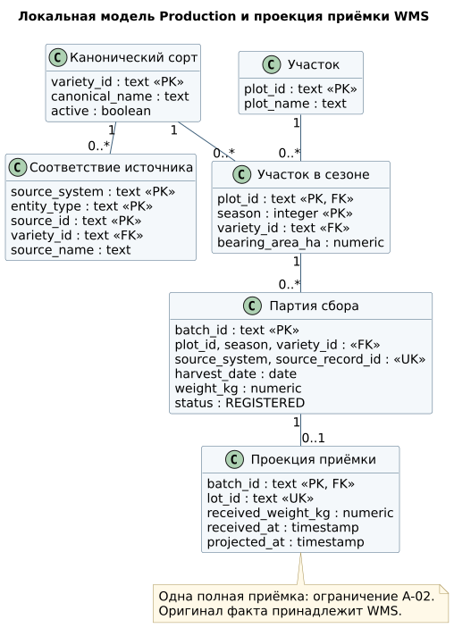
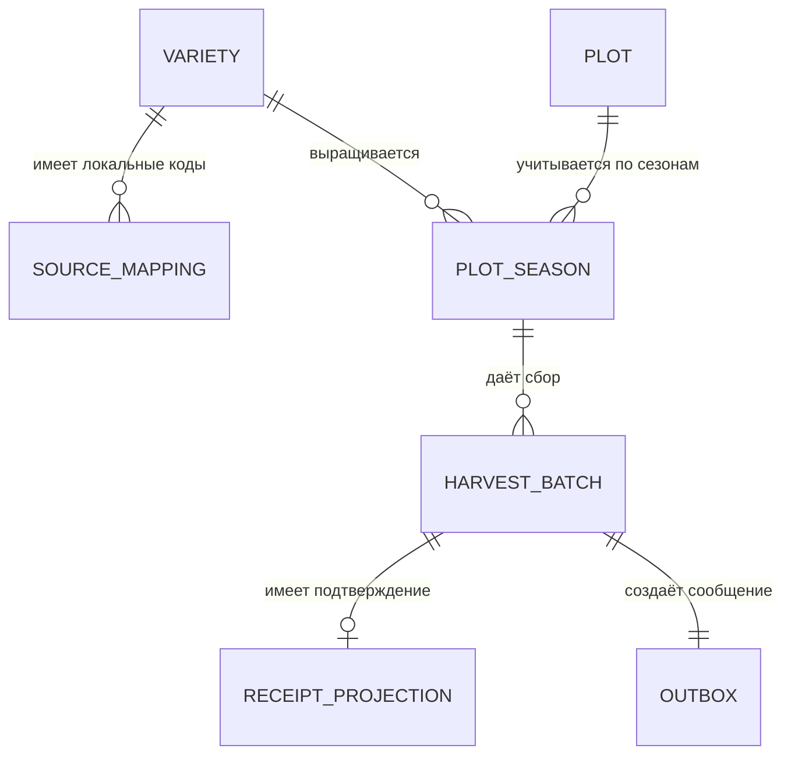
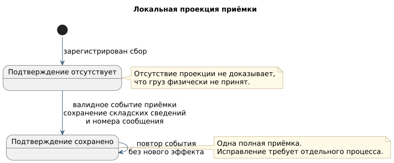

# 🧱 модель данных

Модель отделяет справочные данные, производственный сбор, складское измерение и служебные записи обмена. Точные типы полей и ограничения заданы в [SQL-схеме](../sql/01_schema.sql).

## Исходные источники

До согласованного учёта производство и склад используют собственные документы и локальные коды.

| Источник | Одна запись | Устойчивый ключ |
|:---|:---|:---|
| Реестр посадок | участок в сезоне | `plot_code + season` |
| Локальный справочник сортов | сорт в конкретном источнике | локальный код сорта |
| Журнал сбора | строка документа сбора | номер документа + номер строки |
| Документ приёмки | строка складского документа | склад + номер документа + строка |
| Учётный справочник | номенклатура учётной системы | локальный код номенклатуры |

Пример разрыва: в производственном журнале сорт записан как «ГОЛДЕН ДЕЛИШЕС», на складе — как «Голден», в учётном справочнике — как «Golden Delicious». Похожее название помогает найти кандидата, но не подтверждает, что это одна сущность.

Для старых документов также нельзя надёжно связать сбор и приёмку только по дате и текстовой ссылке. В целевой модели связь строится по переданному `batchId`.

[Примеры исходных данных](../examples/) · [диаграмма исходных структур](../diagrams/as-is-data.puml)

## Связь исходных записей с целевой моделью

| Исходные данные | Целевое поле | Значение |
|:---|:---|:---|
| Локальный код сорта | `source_mapping.source_id → variety_id` | подтверждённое соответствие локального и единого кодов |
| Номер документа и строки сбора | `source_system + source_record_id` | идентификатор исходного факта в конкретной системе |
| Участок и сезон | `plot_id + season` | посадка и её плодоносящая площадь |
| Масса и исходная единица | `weight_kg` | масса в килограммах; оригинал остаётся в архиве |
| Складской документ | `lot_id` | идентификатор складского факта |
| Связь приёмки со сбором | `receipt_projection.batch_id` | идентификатор производственной партии, полученный складом |

Локальный код сорта, идентификатор производственной партии и складской номер решают разные задачи. Например, `VAR-017` обозначает сорт, `batchId` — конкретный сбор, `lotId` — складскую запись.

## UML и связи

[Исходник PlantUML](../diagrams/data-model.puml).

Для первой версии одна партия создаёт одно сообщение о регистрации и имеет не более одной полной приёмки.

## Назначение таблиц

| Таблица | Одна запись | Основные поля | Правило |
|:---|:---|:---|:---|
| `variety` | единый сорт | `variety_id`, название, активность | переименование не меняет идентификатор |
| `source_mapping` | локальный код сорта в источнике | система, тип сущности, локальный код, единый сорт | сочетание системы, типа и кода уникально |
| `plot` | учётный участок | `plot_id`, название | идентификатор стабилен при переименовании |
| `plot_season` | участок в сезоне | участок, сезон, сорт, площадь | один сорт на участок и сезон |
| `harvest_batch` | строка документа сбора | партия, участок, сорт, дата, масса, исходный ключ | исходный ключ уникален |
| `receipt_projection` | полученные сведения о приёмке | партия, складской номер, масса, время | один факт приёмки на партию |
| `outbox` | сообщение к отправке | идентификатор сообщения, тело, время публикации | сохраняется вместе с партией |
| `inbox` | обработанное сообщение | получатель, идентификатор сообщения, время | повтор не создаёт новую запись |
| `idempotency_request` | результат пользовательского запроса | пользователь, операция, ключ, хеш, ответ | повтор возвращает сохранённый результат |

Производственная система хранит собственные факты и локальную копию складского подтверждения. Оригинал складского документа остаётся в WMS; общей транзакции между системами нет.

## Состояния

[Исходник PlantUML](../diagrams/states.puml).

| Объект | Состояние | Смысл |
|:---|:---|:---|
| Партия сбора | `REGISTERED` | производственный факт сохранён |
| Сведения о приёмке | отсутствуют / сохранены | подтверждение WMS ещё не получено / уже получено |
| Исходящее сообщение | `published_at` пусто / заполнено | публикация ещё не подтверждена / подтверждена брокером |

Эти состояния независимы: отсутствие локального подтверждения не доказывает, что груз физически не принят.

## Расчёт показателей «Паспорта сорта»

Отчёт сводит данные по сорту и сезону, но не скрывает неполные связи между производством и складом.

| Показатель | Расчёт | Ограничение |
|:---|:---|:---|
| Сбор | сумма масс сбора, т | все зарегистрированные партии сорта и сезона |
| Подтверждённая приёмка | сумма складских масс, т | только партии с полученным подтверждением |
| Доля партий с приёмкой | подтверждённые партии / все партии | без партий — NULL |
| Разница масс | приёмка − сбор | только для уже сопоставленных пар |
| Плодоносящая площадь | сумма площадей участков, га | участок учитывается один раз за сезон |
| Урожайность | сбор / площадь | при отсутствии площади — NULL и ошибка качества данных |

Пример: сбор — 15 т, подтверждённая приёмка пока есть только для одной партии: 8,370 т вместо 8,420 т. Разница для этой пары — −0,050 т. Остальные 6,630 т нельзя объявлять потерями: складские подтверждения по ним ещё не получены.

[SQL витрины](../sql/02_passport.sql) сначала отдельно агрегирует партии и площади, затем объединяет результаты. [Контрольный набор](../sql/03_demo.sql) воспроизводит пример. Предельная задержка обновления — 5 минут (NFR-04).
