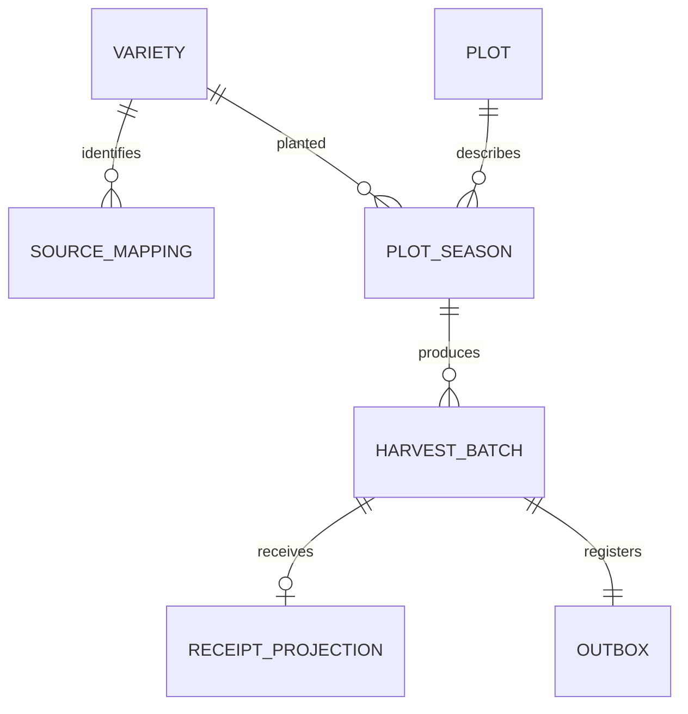

# 🧱 данные и состояния

## Изменение идентичности

Исходная модель — в [AS-IS](as-is-data.md). Канонический сорт не заменяет локальную запись: `source_mapping` хранит обе идентичности. `source_record_id` относится к исходному документу / строке, `batch_id` — к новому производственному факту, `lot_id` — к факту WMS. Их области уникальности различны.

| Исходное поле | Целевое поле | Правило |
|:---|:---|:---|
| `legacy_variety_code` | `source_mapping.source_id` → `variety_id` | Только утверждённое соответствие |
| Документ и строка сбора | `source_system + source_record_id` | Полный ключ с областью нумерации, не номер строки снимка |
| Код участка и сезон | `plot_id + season` | Отдельный реестр участка; A-01 |
| Масса и единица | `weight_kg` | Явное преобразование; оригинал в переходном архиве |
| Ссылка WMS на сбор | `receipt_projection.batch_id` | Для новых фактов передаётся в событии; для истории подтверждается сверкой |

## UML целевых сущностей

[PlantUML](../diagrams/data-model.puml). Диаграмма описывает локальную модель Production и его проекции; оригинал складского факта хранится WMS. Технические таблицы представлены ниже в словаре.

## Логическая ERD

`receipt_projection` — локальная копия факта WMS, не складской остаток. `outbox` относится к событию регистрации в этой ограниченной модели; при новых типах событий связь станет 1:N. На логической ERD показаны предметные связи; таблицы inbox и идемпотентности обслуживают доставку и запросы.

## Словарь

| Сущность / ключ | Атрибуты | Инвариант / владелец |
|:---|:---|:---|
| `variety(variety_id)` | canonical_name text, active boolean | MDM; имя не ключ |
| `source_mapping(source_system, entity_type, source_id)` | variety_id FK, source_name text | Для v1 entity_type только VARIETY |
| `plot(plot_id)` | plot_name text | Production |
| `plot_season(plot_id, season)` | variety_id FK, bearing_area_ha numeric(12,3) | Один сорт на участок/сезон; площадь > 0 |
| `harvest_batch(batch_id)` | plot_id, season, variety_id, source_system, source_record_id, harvest_date date, weight_kg numeric(12,3), status | Составной FK проверяет участок–сезон–сорт; масса > 0; один исходный факт |
| `receipt_projection(batch_id)` | lot_id UNIQUE, received_weight_kg, received_at timestamptz, projected_at timestamptz | Один факт полной приёмки, WMS владеет оригиналом |
| `outbox(event_id UUID)` | batch_id UNIQUE FK, body jsonb, created_at, published_at | Партия и outbox фиксируются одной транзакцией |
| `inbox(consumer, event_id)` | processed_at timestamptz | Дедупликация в границе конкретного получателя |
| `idempotency_request(principal_id, operation, key)` | request_hash, response_body jsonb, created_at | Ключ UUID; проверка тела и срок на уровне сервиса |

Схема [01_schema.sql](../sql/01_schema.sql) представляет локальную модель Production. Таблицы НСИ здесь — согласованная реплика, `receipt_projection` обновляется потребителем. WMS сохраняет оригинал в собственной БД; общей транзакции между сервисами нет.

## UML состояний проекции

[PlantUML](../diagrams/states.puml). Состояние проекции показывает наличие подтверждения в Production; оно не заменяет складской статус.

## Разделение состояний

| Объект | Состояния | Значение |
|:---|:---|:---|
| Производственная партия | `REGISTERED` | Производственный факт принят; отмена и редактирование вне v1 |
| Проекция приёмки | отсутствует → присутствует | Подтверждение WMS поступило; отсутствие не доказывает, что приёмки не было |
| Outbox | `published_at IS NULL` → заполнено | Брокер подтвердил публикацию; это не подтверждение WMS |

Объединять их в цепочку `CREATED → SENT → RECEIVED` ошибочно: это смешивает бизнес-факт и доставку. [UML состояний](../diagrams/states.puml) описывает проекцию приёмки; сбой интеграции не меняет производственный статус партии.
