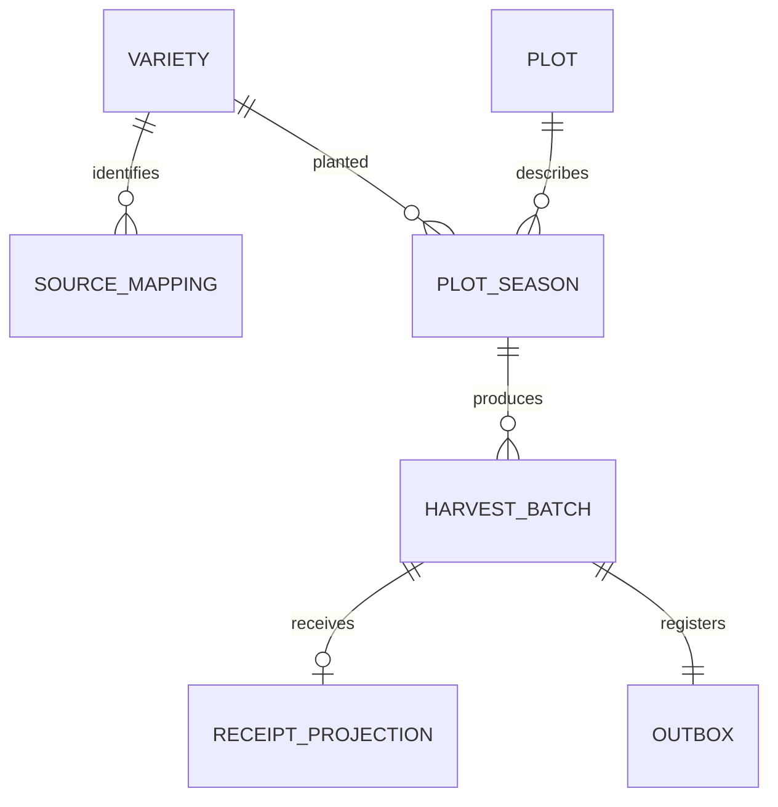

# 🧱 данные и состояния

## Логическая модель

`receipt_projection` — локальная копия факта WMS, не складской остаток. `outbox` относится к событию регистрации в этой ограниченной модели; при новых типах событий связь станет 1:N. На логической ERD показаны предметные связи; таблицы inbox и идемпотентности обслуживают доставку и запросы.

## Словарь

| Сущность / ключ | Атрибуты | Инвариант / владелец |
|:---|:---|:---|
| `variety(variety_id)` | canonical_name text, active boolean | MDM; имя не ключ |
| `source_mapping(source_system, entity_type, source_id)` | variety_id FK, source_name text | Для v1 entity_type только VARIETY |
| `plot(plot_id)` | plot_name text | Production |
| `plot_season(plot_id, season)` | variety_id FK, bearing_area_ha numeric(12,3) | Один сорт на участок/сезон; площадь > 0 |
| `harvest_batch(batch_id)` | plot_id, season, variety_id, source_system, source_record_id, harvest_date date, weight_kg numeric(12,3), status | Составной FK проверяет участок–сезон–сорт; масса > 0; один исходный факт |
| `receipt_projection(batch_id)` | lot_id UNIQUE, received_weight_kg, received_at timestamptz, projected_at timestamptz | Один факт полной приёмки, WMS владеет оригиналом |
| `outbox(event_id UUID)` | batch_id UNIQUE FK, body jsonb, created_at, published_at | Партия и outbox фиксируются одной транзакцией |
| `inbox(consumer, event_id)` | processed_at timestamptz | Дедупликация в границе конкретного получателя |
| `idempotency_request(principal_id, operation, key)` | request_hash, response_body jsonb, created_at | Ключ UUID; проверка тела и срок на уровне сервиса |

Схема [01_schema.sql](../sql/01_schema.sql) представляет локальную проекцию единого демонстрационного контура. Реальные сервисы не должны менять чужие таблицы общей транзакцией. Таблицы MDM здесь — локальная реплика, `receipt_projection` обновляется потребителем.

## Разделение состояний

| Объект | Состояния | Значение |
|:---|:---|:---|
| Производственная партия | `REGISTERED` | Производственный факт принят; отмена и редактирование вне v1 |
| Проекция приёмки | отсутствует → присутствует | Подтверждение WMS поступило; отсутствие не доказывает, что приёмки не было |
| Outbox | `published_at IS NULL` → заполнено | Брокер подтвердил публикацию; это не подтверждение WMS |

Объединять их в цепочку `CREATED → SENT → RECEIVED` ошибочно: это смешивает бизнес-факт и доставку. [UML состояний](../diagrams/states.puml) описывает проекцию приёмки; сбой интеграции не меняет производственный статус партии.
