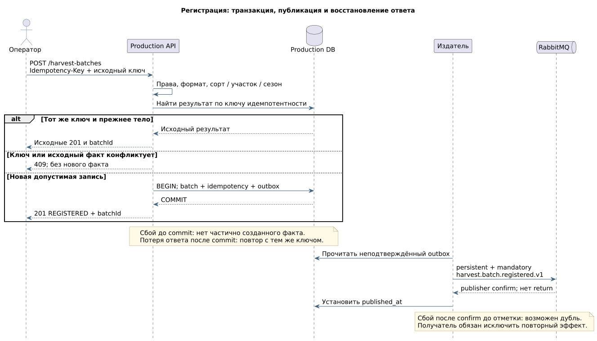
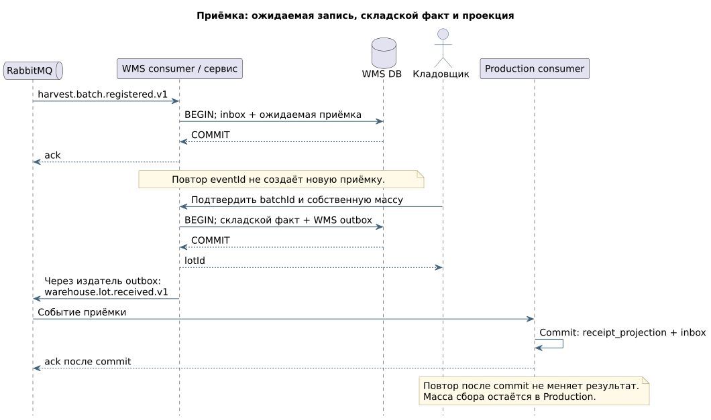

# 🔌 обмен данными между производством и складом

Производственная система регистрирует сбор и передаёт складу реквизиты партии. Кладовщик подтверждает приёмку в WMS. После этого WMS сообщает производственной системе и отчёту складской номер, массу и время приёмки.

У партии есть общий идентификатор `batchId`. Склад сохраняет его вместе со своим номером `lotId`: по этой связи документы сопоставляются без поиска по названию сорта или дате.

## Запросы API

API — интерфейс, через который пользовательский инструмент или другая система передаёт запрос и получает ответ. [OpenAPI](../contracts/openapi.yaml) описывает параметры, поля и ошибки этих операций.

| Действие | Запрос | Успешный результат |
|:---|:---|:---|
| Найти единый сорт по локальному коду источника | `GET /api/v1/source-mappings/resolve` | Согласованный идентификатор сорта `varietyId` |
| Зарегистрировать документ сбора | `POST /api/v1/harvest-batches` | Номер партии `batchId` и статус `REGISTERED` |
| Открыть зарегистрированную партию | `GET /api/v1/harvest-batches/{batchId}` | Реквизиты сбора и полученные сведения о приёмке |

Операция поиска сорта относится к справочникам; операции с партиями — к производственному учёту. Адреса систем задаются в спецификации для каждого пути. Ответ `201 Created` означает, что сбор сохранён. Подтверждение складской приёмки поступает позже.

## Сообщения о произошедших действиях

| Когда отправляется сообщение | Название в контракте | Получатели | Что передаётся |
|:---|:---|:---|:---|
| Производство зарегистрировало сбор | `harvest.batch.registered.v1` | WMS и BI | Партия, участок, сорт, сезон, дата, масса и ключ исходного документа |
| Склад подтвердил приёмку | `warehouse.lot.received.v1` | Production и BI | Производственная партия, складской номер, масса и время приёмки |

У каждого сообщения есть собственный номер `eventId`. При повторной отправке номер сохраняется. Общий `correlationId` связывает регистрацию и последующие сообщения для поиска в журнале. Структура полей — в [схеме сообщений](../contracts/events.schema.json), примеры — [сбор](../examples/harvest-event.json) и [приёмка](../examples/receipt-event.json).

## Последовательность регистрации

[Исходник PlantUML](../diagrams/sequence.puml).

Производственная система одной транзакцией сохраняет три записи: партию, результат пользовательского запроса и сообщение для последующей отправки. Таблица исходящих сообщений называется `outbox`. Если сохранение не завершилось, ни одна из трёх записей не считается созданной.

После сохранения оператор получает номер партии. Отдельный процесс читает `outbox` и отправляет сообщения в RabbitMQ. Поэтому временная недоступность склада не блокирует регистрацию сбора.

## Последовательность приёмки

[Исходник PlantUML](../diagrams/receipt-sequence.puml).

WMS получает сообщение о сборе и создаёт ожидаемую приёмку. Когда кладовщик подтверждает груз, WMS одной транзакцией сохраняет складской факт и своё исходящее сообщение. Получатели сохраняют складские сведения как локальную копию для отображения и расчёта отчёта. Производственная масса при этом остаётся прежней.

## Как сообщения доходят до получателей

RabbitMQ принимает сообщения и помещает их в очереди. Для каждой системы-получателя выделена отдельная очередь: WMS и BI должны получить собственные копии сообщения о сборе.

| Сообщение | Очередь | Кто обрабатывает |
|:---|:---|:---|
| Сбор зарегистрирован | `wms.harvest.v1` | WMS: создаёт ожидаемую приёмку |
| Сбор зарегистрирован | `bi.harvest.v1` | BI: сохраняет данные сбора |
| Приёмка подтверждена | `production.receipts.v1` | Production: сохраняет складские сведения |
| Приёмка подтверждена | `bi.receipts.v1` | BI: сохраняет данные приёмки |

Техническая конфигурация: обменник `agri.events` типа `topic`, сохраняемый при перезапуске (`durable`); сообщения сохраняются на диск (`persistent`); рабочие очереди используют репликацию `quorum`. Ключ маршрутизации состоит из типа сообщения и основной версии: например, `harvest.batch.registered.v1`.

## Подтверждения и повторы

| Ситуация | Поведение системы |
|:---|:---|
| RabbitMQ ещё не подтвердил публикацию | Отправитель повторяет сообщение с прежним `eventId` |
| Брокер подтвердил публикацию, но отправитель не успел отметить это в БД | Повтор возможен; получатель должен распознать дубль |
| Получатель сохранил данные, но не успел подтвердить обработку | Сообщение доставляется повторно; повторная запись не создаётся |
| БД получателя временно недоступна | Выполняются три повторные попытки: через 30 секунд, 2 минуты и 10 минут |
| Все повторные попытки неуспешны | Сообщение переносится в очередь ошибок — DLQ — для разбора сопровождением |
| Структура или версия сообщения не поддерживается | Сообщение сразу направляется в очередь ошибок с причиной отказа |

Отправитель отмечает публикацию после подтверждения RabbitMQ (`publisher confirm`) и проверки, что сообщение не возвращено из-за отсутствия маршрута (`mandatory return`). Получатель подтверждает обработку (`ack`) только после сохранения данных.

Обработанные номера сообщений хранятся в таблице `inbox` вместе с именем получателя. Кроме этой проверки, действуют ограничения по самой партии: повтор сообщения с другим номером также не должен создать вторую полную приёмку. Повторная обработка без повторного результата называется идемпотентностью.

При переносе в очередь повторов или ошибок исходное сообщение подтверждается только после подтверждённой отправки в новую очередь. При возврате из DLQ сохраняются `eventId`, причина ошибки и запись о выполненном разборе. Такие правила допускают повтор доставки, но защищают от повторного создания бизнес-записи.

## Порядок сообщений и разница масс

BI может получить сообщение о приёмке раньше сообщения о сборе: очереди обрабатываются независимо. В этом случае складские сведения сохраняются отдельно по `batchId` и связываются после получения сбора. Запись с обязательной ссылкой на партию создаётся только после появления этой партии.

Масса приёмки не обязана совпадать с массой сбора. Отчёт показывает обе величины и разницу; превышение или уменьшение массы не приводит к автоматическому удалению факта. Дата приёмки проверяется после получения обоих фактов и не должна предшествовать дате сбора. Причину расхождения разбирают производство и склад — [сценарий UC-05](use-cases.md).

## Изменения формата

В пределах версии 1 можно добавлять необязательные поля; получатели игнорируют незнакомые поля. Удаление поля, изменение типа или его смысла требует новой основной версии и нового ключа маршрутизации. Время передаётся в UTC в формате RFC 3339.

## Ошибки API

| HTTP | Когда возникает | Код для программной обработки |
|:---|:---|:---|
| 400 | Некорректный JSON, формат поля или обязательный заголовок | `INVALID_REQUEST` |
| 401 | Пользователь не прошёл проверку подлинности | `UNAUTHENTICATED` |
| 403 | У пользователя нет права на действие | `FORBIDDEN` |
| 404 | Не найдено соответствие сорта или партия | `MAPPING_NOT_FOUND` / `BATCH_NOT_FOUND` |
| 409 | Повторный ключ с другим содержимым или уже зарегистрированный документ | `IDEMPOTENCY_CONFLICT` / `SOURCE_RECORD_EXISTS` |
| 422 | Неверная масса, дата, сорт или связь с участком | `INVALID_REFERENCE` / `INVALID_BUSINESS_VALUE` |
| 503 | Производственная система или её БД временно недоступна | `TEMPORARILY_UNAVAILABLE` |

Технические основания: [надёжность RabbitMQ](https://www.rabbitmq.com/docs/reliability), [подтверждения RabbitMQ](https://www.rabbitmq.com/docs/confirms), [OpenAPI 3.0.3](https://spec.openapis.org/oas/v3.0.3).
