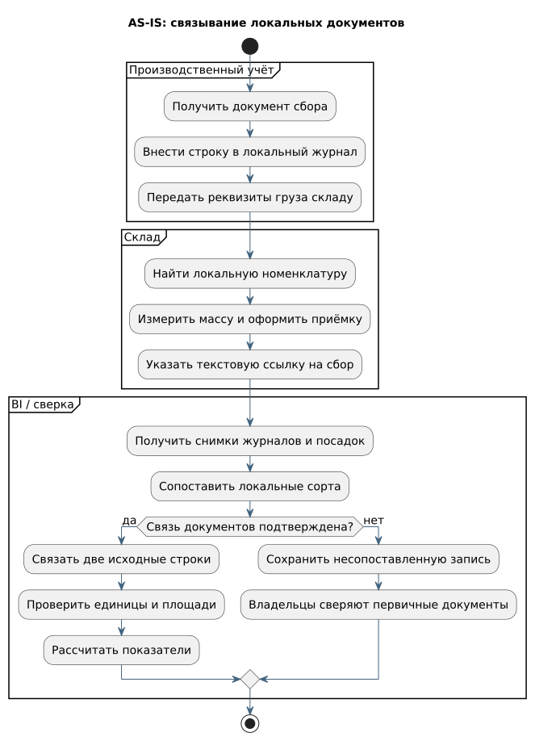
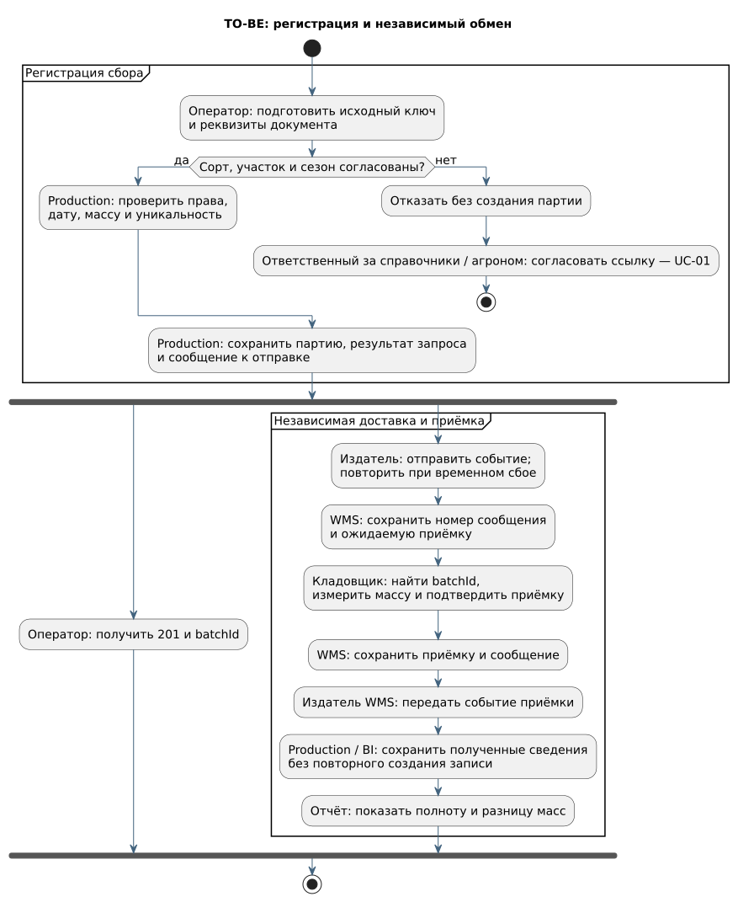

# 🔄 от документа сбора к приёмке

## Исходный процесс — AS-IS

Оператор переносит документ сбора в производственный журнал. Кладовщик оформляет собственный документ и выбирает сорт по складскому справочнику. Для отчёта аналитик получает оба журнала и реестр посадок, согласует сорта и проверяет связи документов.

[Исходник PlantUML](../diagrams/as-is-process.puml). Если связи документов недостаточно, запись остаётся несопоставленной и передаётся владельцам для сверки. Структуры источников описаны в [исходной модели данных](as-is-data.md).

## Целевой процесс — TO-BE

[Исходник PlantUML](../diagrams/to-be-process.puml) · [BPMN передачи данных Production / WMS](../diagrams/batch-process.bpmn).

| Этап | Кто выполняет | Что происходит | Если возникла ошибка |
|:---|:---|:---|:---|
| Согласование сорта | Ответственный за справочники и главный агроном | Подтверждают связь локального кода с единым сортом | Запись остаётся неразрешённой — UC-01 |
| Проверка сбора | Оператор и Production | Проверяют документ, участок, сорт, сезон, дату и массу | Отказ без создания партии — UC-02 |
| Регистрация | Production | Одной транзакцией сохраняет партию, результат запроса и сообщение к отправке | Клиент повторяет запрос с прежним ключом |
| Передача складу | Отправитель и получатель WMS | Передают реквизиты партии и создают одну ожидаемую приёмку | Повторная доставка; после неуспешных попыток — очередь ошибок |
| Приёмка груза | Кладовщик | Подтверждает производственную партию и собственную массу | Сверка с производством — UC-03, UC-05 |
| Обновление отчёта | Получатель BI | Связывает сбор с приёмкой и пересчитывает показатели | Несвязанные записи сохраняются до получения данных; задержка видна в отчёте |

Оператор получает подтверждение регистрации после сохранения сбора. Принятие сообщения RabbitMQ и его обработка получателем происходят отдельно. Физическая приёмка подтверждается кладовщиком в WMS.

## Результат изменения

Склад получает реквизиты из сообщения вместо повторного ввода. Приёмка связана со сбором общим номером `batchId`. Ручная сверка остаётся для старых документов, ошибок и расхождений массы. [Ответственность участников](stakeholders.md) · [сценарии работы](use-cases.md) · [обмен данными](integration.md).
