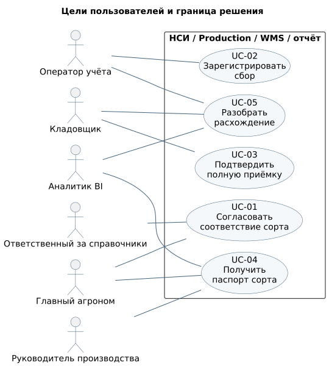

# 👤 варианты использования

Граница диаграммы — решение целиком: управляемый реестр НСИ, Production, WMS и отчёт. Это не граница одного API. UC-01 выполняется через согласование реестра, UC-02 — через Production API, UC-03 — в WMS, UC-04 / UC-05 — в отчёте и сверке. Контракты интерфейсов согласования НСИ и пользовательского отчёта в этом срезе не заданы.

[PlantUML](../diagrams/use-cases.puml). Связь с актором означает участие в достижении цели, а не порядок шагов. Повтор доставки события относится к системному взаимодействию внутри UC-03.

## UC-01 · согласовать соответствие сорта

**Цель:** разрешить локальный код без создания дубликата сорта. **Основной актор:** ответственный за НСИ (SH-04). **Участник:** главный агроном (SH-02). **Триггер:** новый или неразрешённый ключ источника. **Предусловия:** доступен исходный снимок, источник и устойчивый локальный код; актор имеет право вести реестр.

| Шаг | Действие участника | Ответ системы / реестра |
|:---|:---|:---|
| 1 | Открывает неразрешённую запись | Показывает код, исходное имя, источник и существующие соответствия |
| 2 | Сравнивает кандидатов с агрономом | Показывает канонический ID и атрибуты; похожее имя не считается подтверждением |
| 3 | Фиксирует решение и его основание | Проверяет, что ключ не утверждён для другого сорта |
| 4 | Передаёт изменение на согласование | Сохраняет автора, согласующего, дату и затронутые ключи |
| 5 | Выпускает согласованный срез | Потребители получают соответствие; заблокированную запись можно обработать повторно |

**Альтернатива 2а:** нужного сорта нет — главный агроном подтверждает создание канонической записи; после этого продолжается шаг 3. **Исключение 3а:** ключ уже связан с другим сортом — выпуск блокируется до анализа зависимых фактов. **Исключение 2б:** подтверждения недостаточно — запись остаётся `UNRESOLVED`.

**Успех:** один утверждённый ключ соответствует одному сорту; основание решения доступно. **Минимальная гарантия:** история не переназначается молча. **Связи:** BR-01, FR-01, FR-06; AC-01, AC-19.

## UC-02 · зарегистрировать сбор

**Цель:** зафиксировать один подтверждённый факт сбора. **Актор:** оператор производственного учёта (SH-03). **Триггер:** получен документ сбора. **Предусловия:** активный сорт разрешён, участок и сезон согласованы, исходной строке назначен устойчивый ключ; роль `production_operator`.

| Шаг | Действие актора | Ответ Production |
|:---|:---|:---|
| 1 | Выбирает документ / строку, участок, сезон и сорт | Показывает данные согласованной реплики |
| 2 | Указывает дату и массу в кг, отправляет регистрацию | Проверяет права, формат, дату, массу и участок–сезон–сорт |
| 3 | Ожидает подтверждение | В одной транзакции сохраняет партию, результат запроса и outbox |
| 4 | Получает результат | Возвращает `201`, `batchId`, `REGISTERED`; ожидается отдельная приёмка |

**Альтернатива 4а:** ответ потерян — повтор с тем же `Idempotency-Key` и телом возвращает исходный результат. **Исключение 2а:** нет соответствия — сначала UC-01, партия не создаётся. **Исключение 2б:** источник уже зарегистрирован с другим ключом — `409 SOURCE_RECORD_EXISTS`; оператор открывает существующую партию. **Исключение 2в:** изменённое тело при том же ключе — `409 IDEMPOTENCY_CONFLICT`. **Исключение 3а:** БД недоступна — ошибка без частичного сохранения, повтор с прежним ключом.

**Успех:** одна партия и одно событие регистрации. **Минимальная гарантия:** отсутствие частично созданной партии. Недоступность WMS не блокирует шаг 3. **Связи:** BR-02, FR-02, FR-03, NFR-01 / 02 / 03; AC-02–08, AC-13–14, AC-18.

## UC-03 · подтвердить полную приёмку

**Цель:** связать фактически принятый груз со сбором и сохранить складское измерение. **Актор:** кладовщик (SH-05). **Поддерживающая система:** Production. **Триггер:** груз прибыл на склад. **Предусловия:** WMS получила событие регистрации и создала одну ожидаемую приёмку с `batchId`; право складской приёмки проверяется WMS.

| Шаг | Действие участника | Ответ WMS / обмена |
|:---|:---|:---|
| 1 | Находит ожидаемую приёмку по переданному ID | Показывает исходный сбор и реквизиты партии |
| 2 | Фиксирует массу складского измерения | Проверяет положительное значение и наличие исходной партии |
| 3 | Подтверждает полную приёмку | Сохраняет один складской факт и WMS outbox атомарно |
| 4 | Получает складской ID | Публикуется `warehouse.lot.received.v1`; проекция Production / BI обновляется отдельно |

**Исключение 1а:** груз есть, ожидаемой приёмки нет — кладовщик инициирует разбор доставки; произвольная связь по названию запрещена. Физические действия с грузом регулируются складом и вне контракта. **Альтернатива 2а:** масса отличается — обе массы сохраняются, расхождение доступно UC-05. **Исключение 3а:** приёмка уже подтверждена — второй факт запрещён. Повтор сообщения после commit не создаёт вторую ожидаемую приёмку. **Исключение 4а:** брокер недоступен — складской факт сохранён, outbox повторяет публикацию.

**Успех:** один факт приёмки с собственным `lotId` и исходным `batchId`. **Минимальная гарантия:** масса сбора сохраняется. **Связи:** BR-03, FR-04, NFR-01; AC-09–10, AC-16–17. Полная спецификация WMS API не входит в Production OpenAPI.

## UC-04 · получить паспорт сорта

**Цель:** сопоставить сбор, приёмку и урожайность за сезон. **Актор:** руководитель производства / агроном; аналитик BI проверяет расчёт. **Триггер:** запрос отчёта. **Предусловия:** доступны подтверждённые посадки и проекции фактов; пользователь имеет согласованный доступ к отчёту.

1. Пользователь задаёт сорт и сезон.
2. Отчёт независимо агрегирует площадь участков, сбор и сопоставленные приёмки.
3. Отчёт выводит массу сбора, принятую массу, покрытие приёмкой, разницу сопоставленных масс и урожайность.
4. Пользователь раскрывает итог до партий и исходных ключей, проверяет актуальность.

**Альтернатива 2а:** сборов нет — нулевой сбор, покрытие `NULL`; подтверждённая площадь сохраняется. **Исключение 2б:** площади нет — урожайность `NULL` и ошибка качества. **Альтернатива 3а:** нет части приёмок — показано покрытие, разница считается только по связанным парам. **Исключение 4а:** поток отстаёт более 5 минут — признак устаревания, без подмены времени потока датой последнего сбора.

**Успех:** значение воспроизводится по исходным фактам. **Минимальная гарантия:** неполные данные обозначены. **Связи:** BR-04, FR-05, NFR-04; AC-11–12, AC-15; [методика](variety-passport.md).

## UC-05 · разобрать несопоставленную запись или расхождение

**Цель:** установить причину ошибки связи или разницы масс. **Актор:** аналитик BI (SH-09). **Участники:** владельцы исходных фактов. **Триггер:** исключение загрузки, отсутствие приёмки либо разница в отчёте. **Предусловия:** доступны снимки источников, локальные ключи и журнал обработки.

1. Аналитик открывает запись сверки и определяет вид: нет соответствия сорта, конфликт исходного ключа, нет подтверждения приёмки или разница масс.
2. Проверяет документ, единицу и ключи; для нового сорта инициирует UC-01, для сбоя доставки передаёт `eventId` сопровождению.
3. Владельцы производства и склада сверяют первичные документы; сохраняются решение и основание.
4. После устранения причины повторяется загрузка / доставка с прежними устойчивыми ключами; сверяются контрольные суммы.

**Исключение 3а:** две версии одного зарегистрированного факта — изменение заблокировано до определения корректировочного процесса. **Исключение 3б:** доказательств связи нет — запись остаётся несопоставленной. **Альтернатива 2а:** подтверждение было в WMS, но проекция отстала — факт не создаётся повторно; восстанавливается доставка.

**Успех:** причина и решение прослеживаются, повтор не размножает факты. **Минимальная гарантия:** расхождение не объявляется потерей автоматически. **Связи:** FR-05 / 07, BR-03; AC-12, AC-20–21. Записи исторической сверки хранятся в переходном слое, не в транзакционных таблицах Production.
